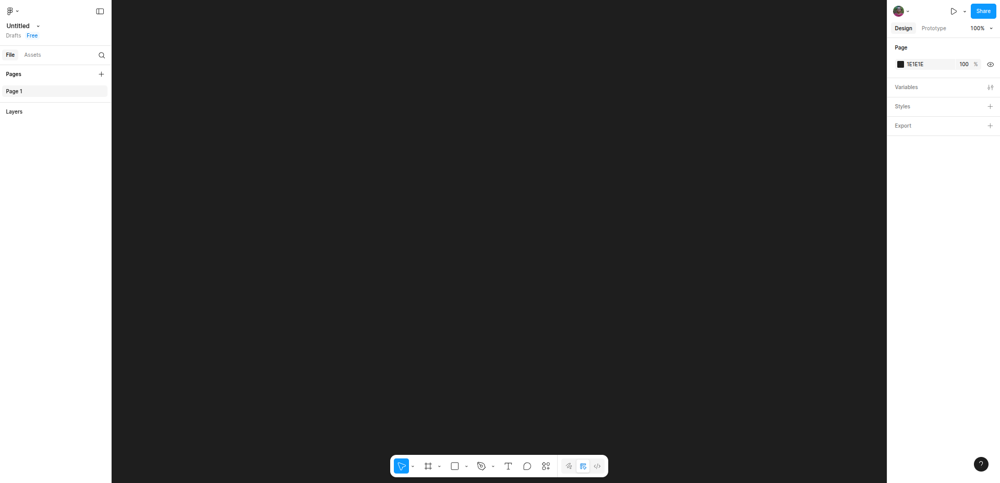
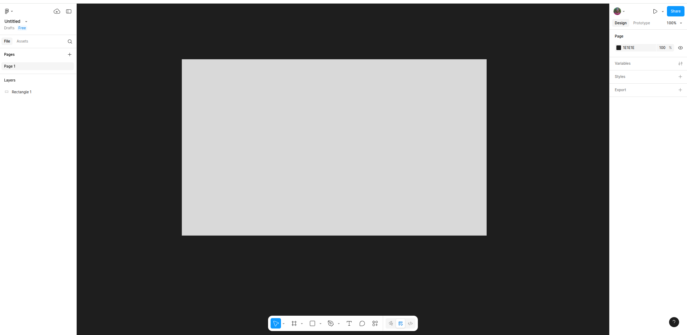
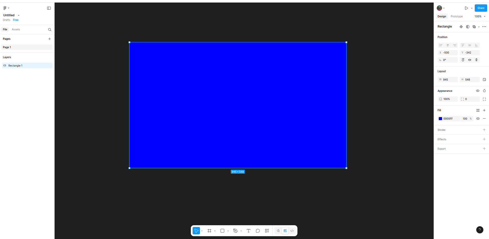
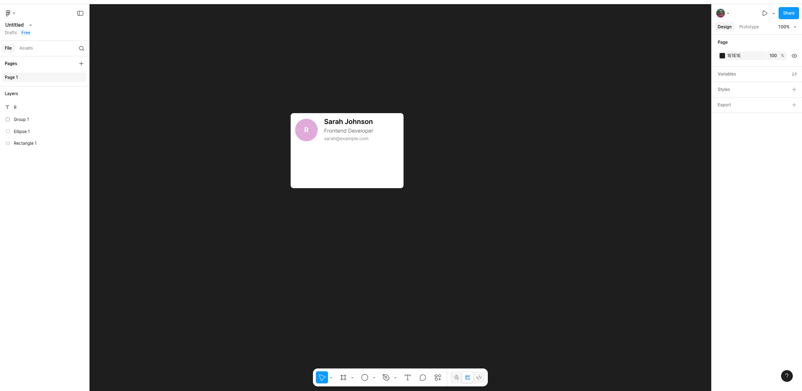
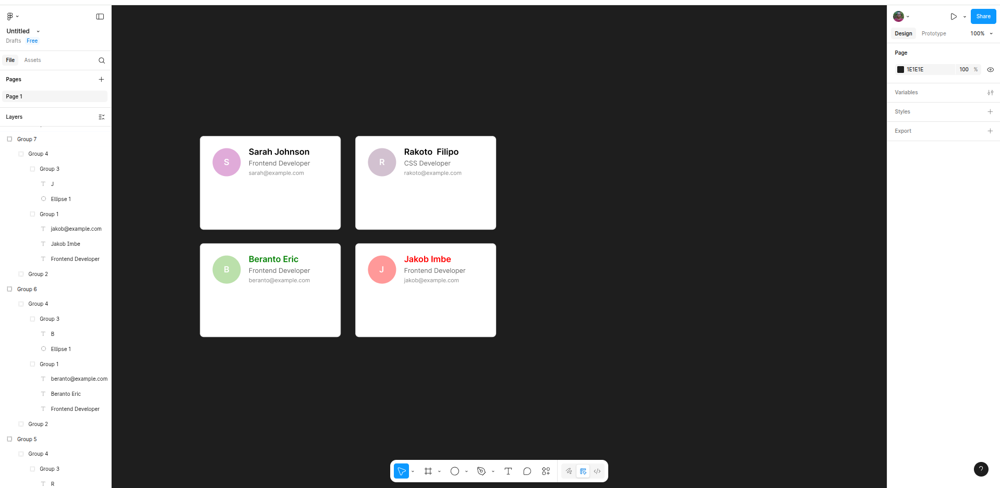

# Figma Lab: From Code to Design

## Welcome!
You've been building websites with HTML and CSS - now it's time to see how designers create the visual blueprints that developers bring to life. In this lab, you'll learn Figma through hands-on exercises that connect directly to your web development experience.

---

## Getting started

### Create your figma account
1. Go to [figma.com](https://figma.com) and sign up for free using your google account
2. You will see a page like in the screenshot below:

3. Click the `Design` button in the tool bar on the top right of the page
4. If you see a different page, it could happen that Figma have updated the page's layout. Just find the `Design` button

### Your First File
1. Click `Design` and skip any ads you might be seeing. This is creating a new design file for you
2. On the Sidebar, you will see **Untitled** - this is the default file name so feel free to name it anything you want or you change it to "My Figma Lab - [Your Name]"
3. You're now in the Figma editor!

---

## Exercise 1: The Figma Interface Tour

### Part A: Get Your Bearings

Figma is like your code editor, but for design. Here’s what you’ll see:

**Canvas (middle area):**

- This is your workspace, like the main part of an HTML page.
- Zoom in and out: Use `Ctrl/Cmd + scroll` or `Ctrl/Cmd and +`.

**Toolbar (bottom of the canvas):**
- Has all the tools you’ll use to draw shapes, add text, and more.
- Think of these as buttons to add things to your design.

**Layers Panel (left side):**
- Shows everything you’ve added, like a list.
- It’s like seeing the structure of your HTML page.

**Properties Panel (right side):**
- Lets you change how things look — colours, size, borders, etc.
- It’s like editing CSS for your design.

### Part B: Create Your First Shape
1. Click the **Rectangle tool**  in the toolbar or press **R** key
2. Draw a rectangle anywhere on the canvas
3. Notice it appears in the Layers panel on the left
4. With it selected, look at the Properties panel on the right.

5. Let's add a blue background colour to it. You can do so by selecting the rectangle and changing the `fill` property value from the right pannel. You can just type **blue** in the field and now your rectagle has a blue background.

**Think About It:** How is this similar to creating a `
` in HTML and styling it with CSS?

---

## Exercise 2: Basic Tools & Properties (15 minutes)

### Part A: Shape Tools Practice
Create these elements (think of them as HTML elements you'd style):

1. **Rectangle (R)**: Draw 3 different sized rectangles
2. **Circle (O)**: Hold `Shift` while dragging to make perfect circles
3. **Text (T)**: Click and type "Hello Figma!"
4. **Line (L)**: Draw a simple line
5. **Arrow(Ctrl + L)**: Draw an arrow

# Figma Properties Tutorial: CSS for Designers

## Part B: The Properties Panel (Your Visual CSS Editor)

Start by selecting your rectangle to explore these CSS-like properties:

### Visual Styling

#### **Fill** (equivalent to `background-color`)
- Click the color square to open the color picker
- Experiment with solid colors using the color wheel
- Try gradients by selecting from the fill type dropdown
- **Pro tip:** Use the eyedropper tool to sample colors from other elements

#### **Stroke** (equivalent to `border`)
- Click the **+** button next to "Stroke" to add a border
- Adjust color and thickness using the controls
- Experiment with stroke positions:
  - **Inside:** Border appears within the shape
  - **Outside:** Border extends beyond the shape
  - **Center:** Border straddles the edge (default)

#### **Corner Radius** (equivalent to `border-radius`)
- Use the corner radius slider to create rounded corners
- Try different values: `0` for sharp corners, higher values for more rounded

### Size & Positioning

#### **Dimensions** (equivalent to `width` and `height`)
- Modify **W** (width) and **H** (height) values directly
- **Tip:** Hold `Shift` while dragging handles to maintain proportions

#### **Position** (equivalent to CSS positioning)
- Change **X** and **Y** coordinates for precise placement
- Use the alignment tools for quick positioning relative to frames
- **Advanced:** Try constraining elements to edges for responsive behavior

### Visual Effects

#### **Appearance Controls** (equivalent to `opacity`, `box-shadow`, `blend-mode`)
- **Opacity:** Use the slider to make elements transparent (0-100%)
- **Effects:** Click the **+** to add:
  - Drop shadows for depth
  - Inner shadows for inset effects
  - Blur for focus effects
- **Blend Modes:** Experiment with different modes for creative color interactions

---

## Part C: Typography (Your Font CSS Properties)

Select any text element to access these typography controls:

### Basic Text Properties
- **Font Family:** Choose from the dropdown (like `font-family`)
- **Font Size:** Adjust the numerical value (like `font-size`)
- **Font Weight:** Select Regular, Bold, etc. (like `font-weight`)
- **Text Color:** Click the color square to change text color

### Text Layout & Spacing
- **Text Alignment:** Left, center, right, or justify
- **Line Height:** Control space between lines (like `line-height`)
- **Letter Spacing:** Adjust space between characters (like `letter-spacing`)
- **Paragraph Spacing:** Add space between paragraphs

---

## Part D: More Advanced Layout Controls

### Layer Management (equivalent to `z-index`)
In the **Layers Panel** (That's the left sidebar) - You right-click on the layer or use a keyboard shortcut to perfor the actions below:
- Drag layers up/down to change stacking order
- Use **Bring Forward** (Cmd/Ctrl + ]) or **Send Backward** (Cmd/Ctrl + [)
- Higher layers appear in front, lower layers appear behind

### Alignment & Distribution
- **Manual Alignment:** Use alignment tools to position relative to frames
  - Left, center, right alignment
  - Top, middle, bottom alignment
- **Distribution:** Evenly space multiple selected elements

### Auto Layout (equivalent to CSS Flexbox)
**Auto Layout** is Figma's most powerful layout feature:

#### Setting Up Auto Layout
1. Select multiple elements or a frame
2. Click the **Auto Layout** button or press `Shift + A`
3. Elements automatically arrange with consistent spacing

#### Auto Layout Controls
- **Direction:** Switch between horizontal and vertical arrangement
- **Alignment:** Control how items align within the container
- **Padding:** Add internal spacing (like CSS `padding`)
- **Gap:** Control spacing between items (like CSS `gap`)
- **Resizing:** Set how items grow or shrink

#### Auto Layout Benefits
- **Responsive:** Elements automatically adjust when content changes
- **Consistent:** Maintains perfect spacing without manual adjustment
- **Efficient:** Like writing `display: flex` but with visual controls

**Pro Tip:** These properties work just like CSS. You're just using a visual interface instead of typing code!

---

## Exercise 3: Build a Simple Card Component

Let's create something you might actually code - a user card component!

### Step 1: Create the Card Container
1. Draw a rectangle (this is your card container)
2. Size: 300px wide × 200px tall
3. Fill: White (#FFFFFF)
4. Stroke: 1px, #E0E0E0 (light gray border)
5. Corner radius: 8px

### Step 2: Add an Avatar
1. Create a circle inside your card
2. Size: 60px × 60px
3. Position it in the top-left area of the card
4. Add a character letter in it
5. Fill: Choose any color (this represents a profile image)

### Step 3: Add Text Content on the right side of the avatar
Create these text elements (stack them vertically):

**Name:** 
- Text: "Sarah Johnson"
- Font size: 18px
- Font weight: Semi-bold

**Title:**
- Text: "Frontend Developer"
- Font size: 14px
- Font weight: Regular
- Color: #666666 (gray)

**Email:**
- Text: "sarah@example.com"
- Font size: 12px
- Color: #888888 (lighter gray)

### Step 4: Position Everything
- Arrange elements with proper spacing
- Use the alignment tools in the toolbar to align text
- Leave margins around the edges (like CSS padding)

***Result****: your card should look similar to the one in the screenshot below:

**Challenge:** Think about how you'd code this card in HTML/CSS. What elements would you use? How would you structure the CSS?

---

## Exercise 4: Frames & Auto Layout

Frames are like `
` containers that help organize your design.

### Part A: Convert to Frame
1. Select all elements of your card (drag to select or Ctrl/Cmd+A)
2. Right-click → "Frame selection" or press Ctrl/Cmd+Alt+G
3. Notice how everything is now contained in a frame

### Part B: Try Auto Layout (Like Flexbox!)
1. Select your frame
2. Press Shift+A or click the Auto Layout button in properties
3. Watch how your elements arrange themselves
4. Try changing:
   - Direction (horizontal/vertical)
   - Spacing between items
   - Padding (like CSS padding)
   - Alignment (like flexbox alignment)

Auto Layout works very similar to CSS Flexbox. t automatically arranges child elements!

---

## Exercise 5: Components & Design Systems

Components in Figma are like reusable CSS classes - create once, use everywhere!

### Part A: Create a Component
1. **Select your best card design** from the previous exercises
2. **Right-click** → "Create component" or press Ctrl/Cmd+Alt+K
3. **Notice the purple outline** - this indicates it's now a master component
4. **Rename it**: Double-click the layer name on the lef pannel and call it "User Card"

### Part B: Create Instances
1. **Drag the component** from the Assets panel (left sidebar) onto your canvas
2. **Or copy-paste** the component (Ctrl/Cmd+C, Ctrl/Cmd+V)
3. **Create 3 instances** and arrange them in a row

### Part C: Override Properties
With each instance, you can override specific properties:
1. **Select an instance** (not the master component)
2. **Double-click the text** to edit names, titles, emails
3. **Change colors** of the avatar circles
4. **Notice**: All instances maintain the same structure and styling, but with different content

***Result:*** You should have multiple cards with different text and colours like below

**🔧 Developer Connection:** This is like having a CSS component class that you can reuse with different content - same structure, different data!

---

## Exercise 6: Collaboration Features

Figma's real power is in real-time collaboration - like Google Docs but for design!

### Part A: Share Your File
1. **Click "Share" button on the top right**
2. **Copy the link** and save it (you'll use this to invite others)
3. **Set permissions**: 
   - "Can view" = Read-only access
   - "Can edit" = Full editing access
4. **Try sharing** with a classmate

### Part B: Comments & Feedback
1. **Select the comment tool** (or press C key or speech bubble icon)
2. **Click anywhere** on your design to add a comment
3. **Type a comment** like: "Should this text be bigger?"
4. **Tag someone** using @ if you shared with classmates
5. **Reply to comments** by clicking on existing comment bubbles

### Part C: Version History
1. **Click the file name** at the top
2. **Select "Show version history"**
3. **See snapshots** of your file at different times
4. **Click any version** to see what it looked like then

**Professional Insight:** In real projects, designers and developers use comments to discuss implementation details, and version history helps track design evolution!

---

## Exercise 7: Advanced Concepts Preview (10 minutes)

Let's explore some powerful features that make Figma indispensable for web projects.

### Part A: Styles & Design Tokens (Like CSS Variables!)
1. **Select your card's title text**
2. **In Properties panel**, click the "Style" icon (four dots) next to text properties
3. **Click "+"** to create a text style
4. **Name it**: "Card Title"
5. **Apply this style** to other card titles by selecting them and choosing the style

**Now the magic:**
1. **Edit the style**: Right-click the style → Edit style
2. **Change the font size** to 20px
3. **Watch all instances update** automatically!

**Color Styles:**
1. **Select a colored element** (like your avatar)
2. **Click the style icon** next to the color picker
3. **Create a color style** called "Primary Blue"
4. **Apply it to other elements**

### Part B: Simple Prototyping (Bringing Designs to Life)
1. **Switch to Prototype mode** (top right tabs: Design | Prototype)
2. **Select your first card**
3. **Drag the blue arrow** that appears to another card
4. **Choose interaction**: "On click" → "Navigate to"
5. **Set animation**: Try "Smart animate"
6. **Test it**: Click the ▶️ play button (top right)

**You just created an interactive prototype!** This shows developers exactly how interactions should work.

### Part C: Dev Mode Preview (Designer-Developer Handoff)
1. **Click the "Dev Mode" toggle** (top right) if available
2. **Select any element** in your design
3. **See the code panel** on the right showing:
   - CSS properties
   - Exact measurements
   - Color values (hex, RGB)
   - Font specifications

**🤝 Bridge Builder:** This is how designers hand off pixel-perfect specs to developers - no more guessing games!

### Part D: Auto Layout Advanced (CSS Grid-like Features)
1. **Select your card frame**
2. **In Auto Layout settings**, try:
   - **Wrap**: Makes items flow to new lines (like flex-wrap)
   - **Gap**: Consistent spacing between items
   - **Fill container**: Makes items expand to fill space
3. **Create a grid**: Duplicate cards and watch them arrange automatically

---

---

## Bonus Challenges (If You Have Extra Time)

### Challenge 1: Collaborative Design Review
- **Pair up with a classmate** (or use your imagination)
- **Share your file** and leave comments on each other's designs
- **Respond to feedback** by making design improvements
- **Practice professional feedback**: Be specific and constructive

### Challenge 2: Component Variations
- **Create variants** of your User Card component (right-click component → Add variant)
- **Make different states**: Default, Hover, Selected
- **Use different properties**: Online/Offline status, Premium/Free user types

### Challenge 3: Design System Thinking
- **Create a color palette** with 3-5 color styles
- **Define typography styles** for different text hierarchy levels
- **Apply consistently** across all your designs
- **Document your choices**: Add comments explaining why you chose certain colors/fonts

### Challenge 4: Responsive Prototype
- **Create mobile and desktop versions** of your card layout
- **Use prototyping** to show how the layout adapts
- **Add realistic interactions**: What happens when you click the card?

### Challenge 5: Developer Handoff Practice
- **Use Dev Mode** to inspect your designs
- **Take screenshots** of the generated CSS
- **Compare** the generated code to how you would write it manually
- **Note differences**: What would you do differently as a developer?

---

## Wrap Up & Reflection (5 minutes)

### What You've Learned
- ✅ Figma interface navigation
- ✅ Basic tools (Rectangle, Circle, Text, Line)
- ✅ Properties panel (colors, typography, sizing)
- ✅ Frames and Auto Layout
- ✅ Component thinking and reusability
- ✅ Collaboration features (sharing, comments, version history)
- ✅ Advanced concepts (styles, prototyping, dev handoff)

### Connect Back to Development
Think about these questions:
- How do Figma components relate to reusable React/Vue components?
- How could design systems improve your CSS architecture?
- What collaboration features would help you work better with designers?
- How might prototyping help you understand user interactions before coding?

### Real-World Applications
**As a Developer, you can now:**
- **Better estimate** development time from designs
- **Communicate more effectively** with designers using design terminology
- **Extract exact specifications** using Dev Mode
- **Understand responsive design** decisions before implementation
- **Participate in design reviews** with informed feedback

### Next Steps
- **Export assets**: Right-click any element → Export to get images for your websites
- **Inspect mode**: Use Dev Mode to get CSS code from designs
- **Collaboration**: Practice sharing and commenting on design files
- **Advanced learning**: Explore component variants, advanced prototyping, and design tokens
- **Integration**: Look into Figma plugins that generate code (React, Vue, HTML/CSS)

### Professional Development
Consider how this connects to your career:
- **Full-stack thinking**: Understanding both design and development makes you more valuable
- **Better communication**: You can now speak both "design" and "code"
- **User-centered approach**: Designing first helps you build better user experiences
- **Team collaboration**: You're now equipped to work seamlessly with design teams

---

## Quick Reference Card

### Essential Shortcuts
- **Select tool**: V
- **Rectangle**: R
- **Circle**: O  
- **Text**: T
- **Comment**: C
- **Zoom to fit**: Shift+1
- **Zoom to selection**: Shift+2
- **Duplicate**: Ctrl/Cmd+D
- **Group**: Ctrl/Cmd+G
- **Auto Layout**: Shift+A
- **Create Component**: Ctrl/Cmd+Alt+K

### Key Concepts
- **Frames** = HTML containers/divs
- **Auto Layout** = CSS Flexbox/Grid
- **Components** = Reusable CSS classes/React components
- **Styles** = CSS variables/design tokens
- **Properties Panel** = CSS styling
- **Layers Panel** = DOM structure
- **Prototyping** = Interactive behavior specification
- **Dev Mode** = Design-to-code handoff tool

### Collaboration Features
- **Share button** = File sharing with permissions
- **Comments (C)** = Design feedback and discussion
- **Version history** = Design change tracking
- **Real-time editing** = Live collaboration like Google Docs

---

*Great job completing the lab! You now have the foundation to start thinking visually about your web projects. Remember: good design makes development easier, and understanding both sides makes you a more valuable team member.*